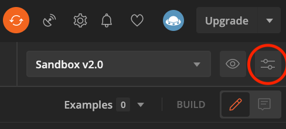
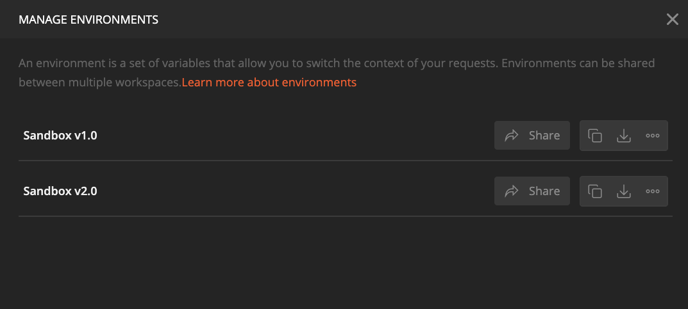
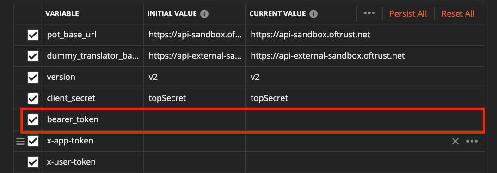
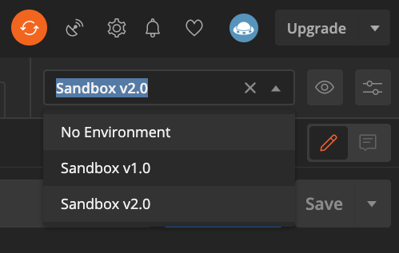

# Platform of Trust Postman Collections
Aim is to aid developers willing to onboard Platform of Trust by familiarizing them with the core Platform APIs without overwhelming knowledge on API structures and functionalities.

# Versions
- [v1](https://github.com/PlatformOfTrust/rest-client-packages/tree/master/postman/v1) for Collections and Environments related to Platform of Trust APIs version 1
- [v2](https://github.com/PlatformOfTrust/rest-client-packages/tree/master/postman/v2) for Collections and Environments related to Platform Of Trust APIs version 2

# Get started
1. [Register](https://world-sandbox.oftrust.net/) to Platform of Trust Sandbox and get [Bearer token](https://developer.oftrust.net/guides/get-bearer-token/#how-to-get-bearer-token)
2. [Download](https://www.postman.com/downloads/) and install Postman API Client
3. Clone [repository](https://github.com/PlatformOfTrust/rest-client-packages) or just download it as zip, then unzip it
4. After launching Postman API Client: click **Import**, Select **Folder** and browse to the above unzipped directory, the postman sub-directory to import the workspace
5. Go to Manage Environment, select desired version of API and paste the copied Bearer Token value under bearer_token attribute. **IMPORTANT: For v1 make sure to include the "Bearer " part from the token, for v2 include only token without "Bearer " part**. Click "Update"

6. From Postman API Client environments, select desired environment.

